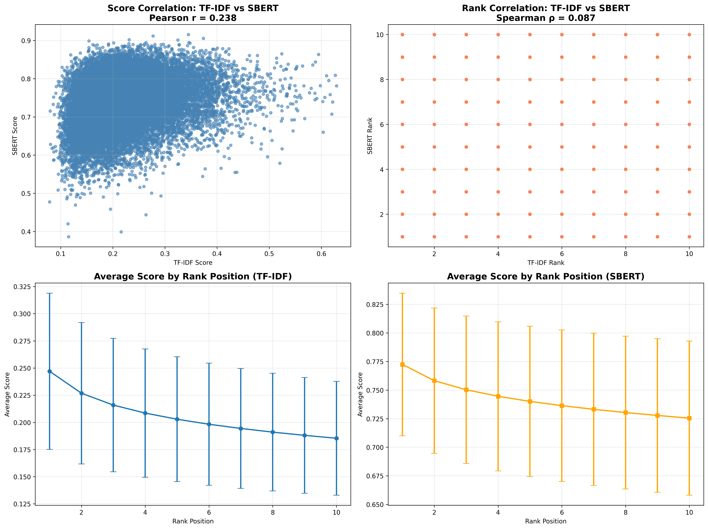
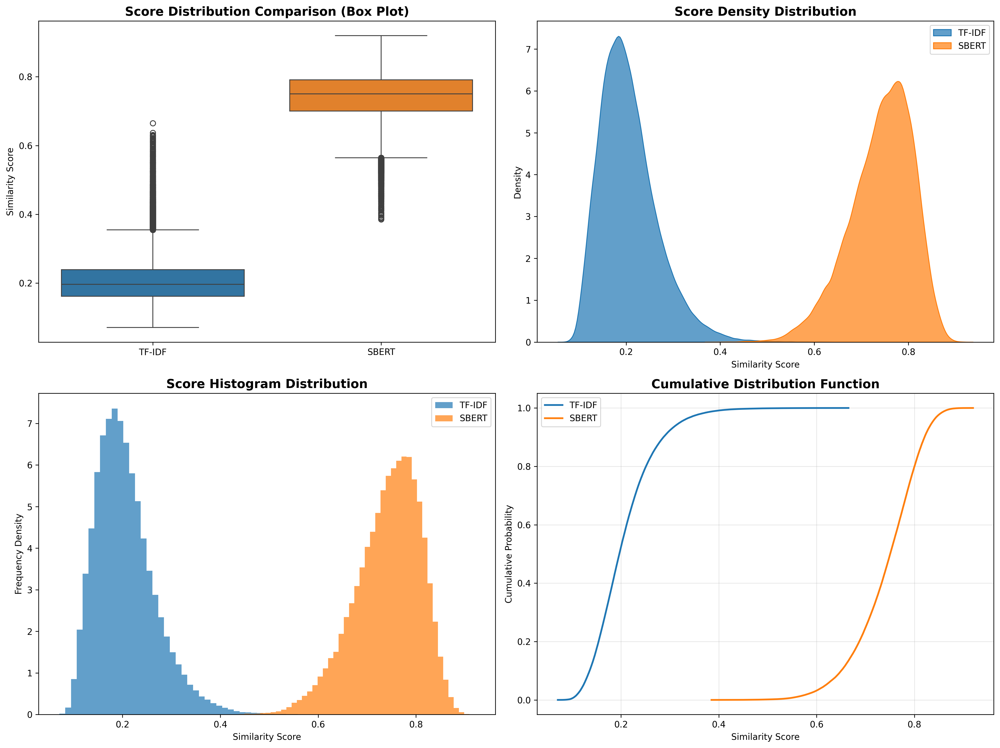
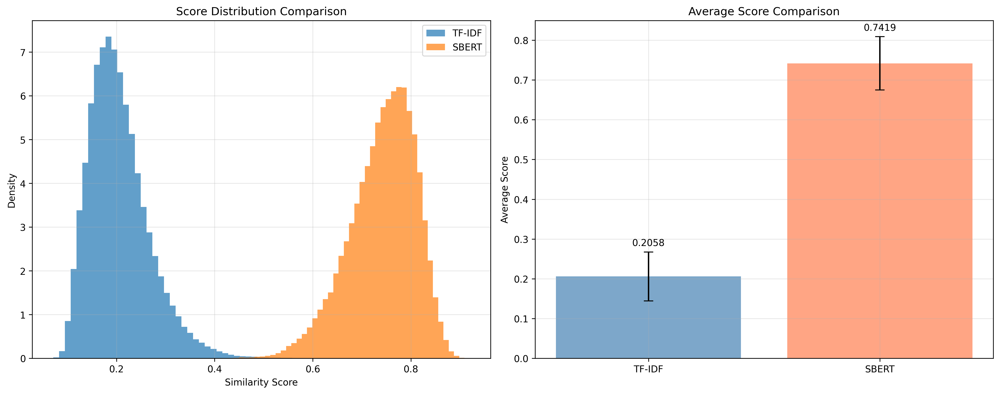
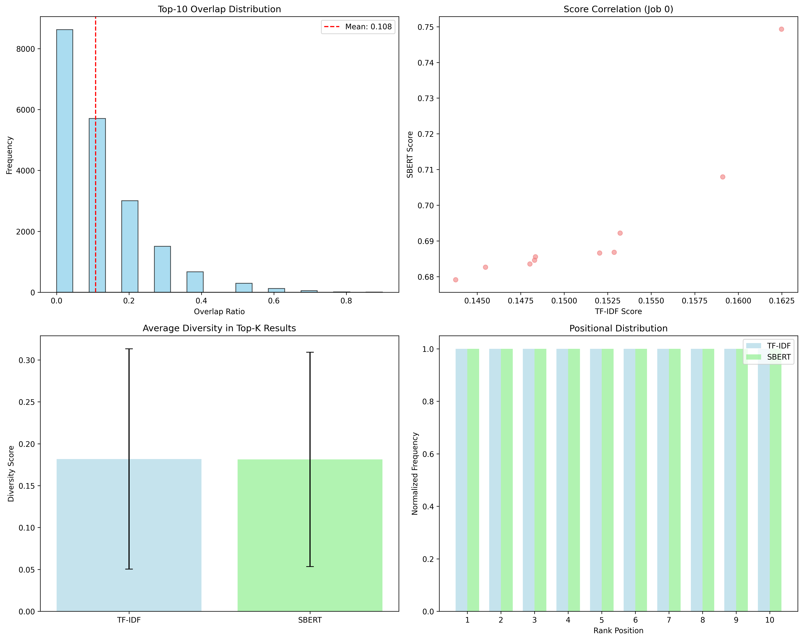
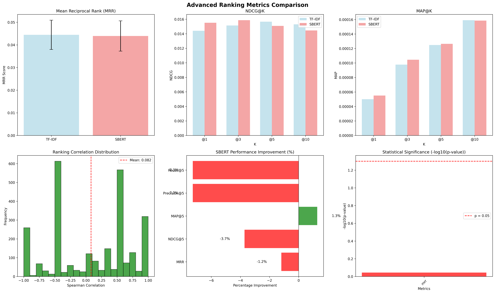

# resume_ranking_tfidf_vs_sbert

# Analysis and Ranking Resumes using Machine‑Learning Algorithms and NLP

## Project Overview
This repository provides an end‑to‑end pipeline for large‑scale resume‑to‑job matching that implements a tuned TF‑IDF+kNN lexical baseline, an SBERT+FAISS semantic system, and optional hybrid fusion, evaluated on stratified samples from the Djinni recruitment datasets with a hiring‑aware ground truth and multi‑metric IR evaluation.
The design mirrors the research: normalize domain vocabulary, extract structured signals, generate a graded relevance ground truth, index and retrieve with both lexical and semantic backends, and evaluate with position‑sensitive metrics and a user attention model.

## Key features
* Scalable modular pipeline: preprocessing, ground truth generation, ranking backends (TF‑IDF, SBERT, hybrid), evaluation, and reporting with reproducible configurations.

* Djinni datasets integration: 141,897 job postings and 210,207 candidate profiles with stratified 20k/20k evaluation to preserve domain and seniority distributions.

* Methods: TF‑IDF (20k features, (1,2)‑grams) with cosine kNN; SBERT all‑MiniLM‑L6‑v2 embeddings with FAISS Flat exact NN search; optional list fusion.

* Ground truth: multi‑dimensional graded relevance (Skills 35%, Domain 25%, Seniority 20%, Experience gap 15%, Title 5%) with ordinal penalties and adjacent domain credit.

* Metrics: MRR, Precision/Recall@K, HitRate@K, nDCG with an exponential attention decay user model (λ≈0.3) and statistical testing.

* Benchmarks: MRR parity, nDCG crossovers (SBERT leads @1/@3, TF‑IDF leads @5/@10), low top‑10 overlap (~10.8%), weak correlations, and clear compute trade‑offs to guide deployment.

# Dataset
* Source: Djinni Recruitment datasets for English‑language Job Descriptions and Candidate Profiles, used in UNLP‑2024, suitable for resume–job matching research and benchmarking.
* recruitment-dataset-job-descriptions-english [https://huggingface.co/datasets/lang-uk/recruitment-dataset-job-descriptions-english]

* recruitment-dataset-candidate-profiles-english [https://huggingface.co/datasets/lang-uk/recruitment-dataset-candidate-profiles-english]

* Scale: 141,897 JDs and 210,207 resumes; evaluation uses stratified 20,000 jobs and 20,000 candidates to preserve domain and seniority distributions.

* Storage: Place original files under data/raw/ as jobs.csv and candidates.csv (or equivalent JSON/Parquet) with columns for titles, descriptions/summary, skills, seniority, and experience where available

# Environment

* Python 3.10+ recommended for consistent library support across scikit‑learn, sentence‑transformers, and faiss‑cpu.

* Install system packages for FAISS if needed (Linux/macOS), or use faiss‑cpu wheels from PyPI when available for the target Python version.

## Installation

    python -m venv .venv
    source .venv/bin/activate           # Windows: .venv\Scripts\activate
    pip install -U pip
    pip install -r requirements.txt

## requirement.txt

    # Data Processing
    pandas>=2.0.0
    numpy==1.26.4
    pyarrow>=12.0.0
    streamlit>=1.28.0

    # Machine Learning & NLP
    scikit-learn>=1.3.0
    sentence-transformers>=2.2.0
    transformers>=4.30.0

    # Similarity Search
    faiss-cpu>=1.7.4
    # OR for GPU: faiss-gpu>=1.7.4

    # Text Processing
    nltk>=3.8
    spacy>=3.6.0
    fuzzywuzzy>=0.18.0
    python-Levenshtein>=0.20.0

    # Visualization & Analysis
    matplotlib>=3.7.0
    seaborn>=0.12.0
    plotly>=5.15.0

    # Utilities
    tqdm>=4.65.0
    PyYAML>=6.0
    psutil>=5.9.0
    scipy>=1.10.0

    # Development & Testing
    jupyter>=1.0.0
    pytest>=7.0.0
    ipykernel>=6.25.0

    # Web & Data Download
    requests>=2.31.0
    wget>=3.2

# Pipeline for this project

[main_20k.py](main_10k.py)

[data_loader.py](data_loader.py)

[ImprovedDataPreprocessor.py](ImprovedDataPreprocessor.py)

[DataProcessingPlots.py](DataProcessingPlots.py)

[tfidf_ranker.py](tfidf_ranker.py)

[AdvancedRankerEvaluator.py](AdvancedRankerEvaluator.py)

## DATASET CHARACTERISTICS AND PREPROCESSING OUTCOMES:
    Professional Domain Distribution:
    Jobs by Domain:
      Software Dev: 12,443 jobs (62.2%)
      Unknown: 2,459 jobs (12.3%)
      Operations: 1,287 jobs (6.4%)
      Data Science: 856 jobs (4.3%)
      Sales: 818 jobs (4.1%)
      Marketing: 648 jobs (3.2%)
      Hr: 637 jobs (3.2%)
      Design: 636 jobs (3.2%)
      Consulting: 74 jobs (0.4%)
      Finance: 66 jobs (0.3%)
      Legal: 41 jobs (0.2%)
      Healthcare: 32 jobs (0.2%)
      Education: 3 jobs (0.0%)

    Candidates by Domain:
      Software Dev: 10,560 candidates (52.8%)
      Operations: 2,179 candidates (10.9%)
      Design: 2,056 candidates (10.3%)
      Data Science: 1,166 candidates (5.8%)
      Hr: 1,110 candidates (5.5%)
      Marketing: 1,008 candidates (5.0%)
      Sales: 956 candidates (4.8%)
      Unknown: 267 candidates (1.3%)
      Finance: 215 candidates (1.1%)
      Consulting: 195 candidates (1.0%)
      Education: 150 candidates (0.8%)
      Healthcare: 76 candidates (0.4%)
      Legal: 62 candidates (0.3%)

    Experience Level Distribution:
    Jobs by Seniority:
      Senior positions: 5,941 jobs (29.7%)
      Junior positions: 5,019 jobs (25.1%)
      Mid positions: 4,748 jobs (23.7%)
      Lead positions: 4,116 jobs (20.6%)
      Unknown positions: 176 jobs (0.9%)
    
    Candidates by Seniority:
      Junior level: 6,335 candidates (31.7%)
      Senior level: 5,313 candidates (26.6%)
      Mid level: 4,719 candidates (23.6%)
      Lead level: 2,191 candidates (11.0%)
      Intern level: 1,442 candidates (7.2%)

## TEXT PROCESSING AND FEATURE EXTRACTION RESULTS
    Average job description length: 268 ± 141 words (post-cleaning)
    Average resume summary length: 172 ± 125 words (post-cleaning)
    Combined document representations: 220 ± 133 words average
    
    Feature Extraction Success Rates:
    Seniority level detection: 99.1% success rate
    Domain classification: 87.7% success rate
    Experience quantification: 100.0% successful extraction rate
    Vocabulary overlap between jobs and resumes: 35.0%

    Plot generation completed. Saved artifacts:
    Plot generation completed. Saved artifacts:
    -jobs_seniority: plots/jobs_seniority_distribution.png
    - cands_seniority: plots/candidates_seniority_distribution.png
    - jobs_domain: plots/jobs_domain_distribution.png
    - cands_domain: plots/candidates_domain_distribution.png
    - cands_exp_hist: plots/candidates_experience_hist.png
    - cands_exp_summary: plots/candidates_experience_summary.csv
    - cands_exp_box_by_seniority: plots/candidates_experience_by_seniority_box.png
    - jobs_keywords: plots/jobs_top15_primary_keywords.png
    - cands_keywords: plots/candidates_top15_primary_keywords.png

## Executing TF-IDF ranking algorithm...
    2025-08-24 17:57:39,881 - __main__ - INFO - Preparing combined text representations
    2025-08-24 17:57:39,884 - __main__ - INFO - Text preparation completed, current memory: 548.7 MB
    2025-08-24 17:57:39,884 - __main__ - INFO - Starting TF-IDF ranking phase
    2025-08-24 17:57:47,810 - resume_ranking_env.resume_ranking_research.model.tfidf_ranker - INFO - TF-IDF vocabulary size: 20000
    Processing 40 batches for TF-IDF ranking...
      Completed 10/40 batches
      Completed 20/40 batches
      Completed 30/40 batches
      Completed 40/40 batches
    2025-08-24 17:59:33,950 - __main__ - INFO - TF-IDF ranking completed: 200000 rankings generated
    TF-IDF ranking completed. Generated 200,000 job-candidate rankings
    2025-08-24 17:59:34,094 - __main__ - INFO - TF-IDF cleanup completed, memory: 609.9 MB
    2025-08-24 17:59:34,094 - __main__ - INFO - Starting SBERT ranking phase

## Executing SBERT semantic ranking algorithm...
    2025-08-24 17:59:35,850 - sentence_transformers.SentenceTransformer - INFO - Use pytorch device_name: mps
    2025-08-24 17:59:35,850 - sentence_transformers.SentenceTransformer - INFO - Load pretrained SentenceTransformer: all-MiniLM-L6-v2
    2025-08-24 17:59:38,434 - __main__ - INFO - Creating embeddings for 20000 candidates...
    2025-08-24 17:59:46,205 - __main__ - INFO - Processed batch 50/625
    2025-08-24 17:59:53,712 - __main__ - INFO - Processed batch 100/625
    2025-08-24 18:00:01,518 - __main__ - INFO - Processed batch 150/625
    2025-08-24 18:00:09,104 - __main__ - INFO - Processed batch 200/625
    2025-08-24 18:00:16,809 - __main__ - INFO - Processed batch 250/625
    2025-08-24 18:00:24,465 - __main__ - INFO - Processed batch 300/625
    2025-08-24 18:00:32,558 - __main__ - INFO - Processed batch 350/625
    2025-08-24 18:00:40,498 - __main__ - INFO - Processed batch 400/625
    2025-08-24 18:00:48,586 - __main__ - INFO - Processed batch 450/625
    2025-08-24 18:00:56,814 - __main__ - INFO - Processed batch 500/625
    2025-08-24 18:01:05,092 - __main__ - INFO - Processed batch 550/625
    2025-08-24 18:01:13,524 - __main__ - INFO - Processed batch 600/625
    Processing 40 batches for SBERT ranking...
    2025-08-24 18:01:17,867 - __main__ - INFO - Created 20000 embeddings successfully
    2025-08-24 18:01:17,871 - __main__ - INFO - Ranking 500 jobs against 20000 candidates...
    2025-08-24 18:01:19,659 - __main__ - INFO - Ranked job batch 20/32
    2025-08-24 18:01:20,720 - __main__ - INFO - Ranking 500 jobs against 20000 candidates...
    2025-08-24 18:01:22,508 - __main__ - INFO - Ranked job batch 20/32
    2025-08-24 18:01:23,494 - __main__ - INFO - Ranking 500 jobs against 20000 candidates...
    2025-08-24 18:01:25,195 - __main__ - INFO - Ranked job batch 20/32
    2025-08-24 18:01:26,156 - __main__ - INFO - Ranking 500 jobs against 20000 candidates...
    2025-08-24 18:01:27,873 - __main__ - INFO - Ranked job batch 20/32
    2025-08-24 18:01:28,850 - __main__ - INFO - Ranking 500 jobs against 20000 candidates...
    2025-08-24 18:01:30,563 - __main__ - INFO - Ranked job batch 20/32
    2025-08-24 18:01:31,532 - __main__ - INFO - Ranking 500 jobs against 20000 candidates...
    2025-08-24 18:01:33,274 - __main__ - INFO - Ranked job batch 20/32
    2025-08-24 18:01:34,285 - __main__ - INFO - Ranking 500 jobs against 20000 candidates...
    2025-08-24 18:01:36,002 - __main__ - INFO - Ranked job batch 20/32
    2025-08-24 18:01:36,968 - __main__ - INFO - Ranking 500 jobs against 20000 candidates...
    2025-08-24 18:01:38,685 - __main__ - INFO - Ranked job batch 20/32
    2025-08-24 18:01:39,666 - __main__ - INFO - Ranking 500 jobs against 20000 candidates...
    2025-08-24 18:01:41,420 - __main__ - INFO - Ranked job batch 20/32
      Completed 10/40 batches
    2025-08-24 18:01:42,415 - __main__ - INFO - Ranking 500 jobs against 20000 candidates...
    2025-08-24 18:01:44,153 - __main__ - INFO - Ranked job batch 20/32
    2025-08-24 18:01:45,130 - __main__ - INFO - Ranking 500 jobs against 20000 candidates...
    2025-08-24 18:01:46,860 - __main__ - INFO - Ranked job batch 20/32
    2025-08-24 18:01:47,825 - __main__ - INFO - Ranking 500 jobs against 20000 candidates...
    2025-08-24 18:01:49,568 - __main__ - INFO - Ranked job batch 20/32
    2025-08-24 18:01:50,544 - __main__ - INFO - Ranking 500 jobs against 20000 candidates...
    2025-08-24 18:01:52,240 - __main__ - INFO - Ranked job batch 20/32
    2025-08-24 18:01:53,201 - __main__ - INFO - Ranking 500 jobs against 20000 candidates...
    2025-08-24 18:01:54,918 - __main__ - INFO - Ranked job batch 20/32
    2025-08-24 18:01:55,898 - __main__ - INFO - Ranking 500 jobs against 20000 candidates...
    2025-08-24 18:01:57,620 - __main__ - INFO - Ranked job batch 20/32
    2025-08-24 18:01:58,583 - __main__ - INFO - Ranking 500 jobs against 20000 candidates...
    2025-08-24 18:02:00,303 - __main__ - INFO - Ranked job batch 20/32
    2025-08-24 18:02:01,286 - __main__ - INFO - Ranking 500 jobs against 20000 candidates...
    2025-08-24 18:02:02,998 - __main__ - INFO - Ranked job batch 20/32
    2025-08-24 18:02:03,989 - __main__ - INFO - Ranking 500 jobs against 20000 candidates...
    2025-08-24 18:02:05,734 - __main__ - INFO - Ranked job batch 20/32
    2025-08-24 18:02:06,716 - __main__ - INFO - Ranking 500 jobs against 20000 candidates...
    2025-08-24 18:02:08,450 - __main__ - INFO - Ranked job batch 20/32
      Completed 20/40 batches
    2025-08-24 18:02:09,442 - __main__ - INFO - Ranking 500 jobs against 20000 candidates...
    2025-08-24 18:02:11,203 - __main__ - INFO - Ranked job batch 20/32
    2025-08-24 18:02:12,180 - __main__ - INFO - Ranking 500 jobs against 20000 candidates...
    2025-08-24 18:02:13,891 - __main__ - INFO - Ranked job batch 20/32
    2025-08-24 18:02:14,855 - __main__ - INFO - Ranking 500 jobs against 20000 candidates...
    2025-08-24 18:02:16,587 - __main__ - INFO - Ranked job batch 20/32
    2025-08-24 18:02:17,562 - __main__ - INFO - Ranking 500 jobs against 20000 candidates...
    2025-08-24 18:02:19,315 - __main__ - INFO - Ranked job batch 20/32
    2025-08-24 18:02:20,294 - __main__ - INFO - Ranking 500 jobs against 20000 candidates...
    2025-08-24 18:02:22,011 - __main__ - INFO - Ranked job batch 20/32
    2025-08-24 18:02:22,988 - __main__ - INFO - Ranking 500 jobs against 20000 candidates...
    2025-08-24 18:02:24,721 - __main__ - INFO - Ranked job batch 20/32
    2025-08-24 18:02:25,709 - __main__ - INFO - Ranking 500 jobs against 20000 candidates...
    2025-08-24 18:02:27,440 - __main__ - INFO - Ranked job batch 20/32
    2025-08-24 18:02:28,422 - __main__ - INFO - Ranking 500 jobs against 20000 candidates...
    2025-08-24 18:02:30,145 - __main__ - INFO - Ranked job batch 20/32
    2025-08-24 18:02:31,136 - __main__ - INFO - Ranking 500 jobs against 20000 candidates...
    2025-08-24 18:02:32,876 - __main__ - INFO - Ranked job batch 20/32
    2025-08-24 18:02:33,897 - __main__ - INFO - Ranking 500 jobs against 20000 candidates...
    2025-08-24 18:02:35,628 - __main__ - INFO - Ranked job batch 20/32
    2025-08-24 18:02:36,611 - __main__ - INFO - Ranking 500 jobs against 20000 candidates...
      Completed 30/40 batches
    2025-08-24 18:02:38,351 - __main__ - INFO - Ranked job batch 20/32
    2025-08-24 18:02:39,344 - __main__ - INFO - Ranking 500 jobs against 20000 candidates...
    2025-08-24 18:02:41,111 - __main__ - INFO - Ranked job batch 20/32
    2025-08-24 18:02:42,113 - __main__ - INFO - Ranking 500 jobs against 20000 candidates...
    2025-08-24 18:02:43,893 - __main__ - INFO - Ranked job batch 20/32
    2025-08-24 18:02:44,930 - __main__ - INFO - Ranking 500 jobs against 20000 candidates...
    2025-08-24 18:02:46,796 - __main__ - INFO - Ranked job batch 20/32
    2025-08-24 18:02:47,828 - __main__ - INFO - Ranking 500 jobs against 20000 candidates...
    2025-08-24 18:02:49,645 - __main__ - INFO - Ranked job batch 20/32
    2025-08-24 18:02:50,809 - __main__ - INFO - Ranking 500 jobs against 20000 candidates...
    2025-08-24 18:02:53,752 - __main__ - INFO - Ranked job batch 20/32
    2025-08-24 18:02:55,327 - __main__ - INFO - Ranking 500 jobs against 20000 candidates...
    2025-08-24 18:02:57,624 - __main__ - INFO - Ranked job batch 20/32
    2025-08-24 18:02:58,812 - __main__ - INFO - Ranking 500 jobs against 20000 candidates...
    2025-08-24 18:03:00,839 - __main__ - INFO - Ranked job batch 20/32
    2025-08-24 18:03:01,944 - __main__ - INFO - Ranking 500 jobs against 20000 candidates...
    2025-08-24 18:03:04,069 - __main__ - INFO - Ranked job batch 20/32
    2025-08-24 18:03:05,420 - __main__ - INFO - Ranking 500 jobs against 20000 candidates...
    2025-08-24 18:03:07,685 - __main__ - INFO - Ranked job batch 20/32
    2025-08-24 18:03:10,261 - __main__ - INFO - Ranking 500 jobs against 20000 candidates...
      Completed 40/40 batches
    2025-08-24 18:03:13,000 - __main__ - INFO - Ranked job batch 20/32
    SBERT ranking completed. Generated 200,000 job-candidate rankings
    2025-08-24 18:03:14,194 - __main__ - INFO - SBERT ranking completed: 200000 rankings generated
    2025-08-24 18:03:14,550 - __main__ - INFO - SBERT cleanup completed, memory: 484.5 MB
    2025-08-24 18:03:14,550 - __main__ - INFO - Saving ranking results

        

## Generating job-related plots...

    **2025-08-24 18:03:38,264 - resume_ranking_env.resume_ranking_research.preprocess.ImprovedDataPreprocessor - INFO - Enhanced ground truth completed for 2000 jobs
    2025-08-24 18:03:38,264 - __main__ - INFO - Ground truth generation completed: 2000 jobs
    2025-08-24 18:03:38,264 - __main__ - INFO - Running comprehensive EDA
    Plot saved: comprehensive_analysis_plots/jobs_primary_keyword_normalized_top15.png
    Plot saved: comprehensive_analysis_plots/jobs_position_top20.png
    Plot saved: comprehensive_analysis_plots/jobs_company_name_top15.png
    Generating candidate-related plots...
    Plot saved: comprehensive_analysis_plots/candidates_primary_keyword_normalized_top15.png
    Plot saved: comprehensive_analysis_plots/candidates_position_top20.png
    Plot saved: comprehensive_analysis_plots/candidates_experience_years_distribution.png
    Generating results-related plots...
    Plot saved: comprehensive_analysis_plots/score_distributions.png
    Plot saved: comprehensive_analysis_plots/correlation_matrix.png
    Plot saved: comprehensive_analysis_plots/top_ranked_candidates.png
    Generating comparative plots...
    Plot saved: comprehensive_analysis_plots/keyword_comparison.png
    Plot saved: comprehensive_analysis_plots/experience_analysis.png
    
    All plots generated and saved in: comprehensive_analysis_plots
    Plot saved: comprehensive_analysis_plots/jobs_primary_keyword_normalized_top15.png
    Plot saved: comprehensive_analysis_plots/candidates_experience_years_distribution.png
    Exploratory data analysis completed**

## COMPREHENSIVE RANKER COMPARISON REPORT (TF-IDF vs SBERT - Top-10 Analysis)

    OVERLAP METRICS:
    Mean Top-10 Overlap: 0.1081 ± 0.1302
    Mean Jaccard Similarity: 0.0628 ± 0.0835
    
    RANK CORRELATION METRICS:
    Spearman Rank Correlation: 0.0502 ± 0.8500
    Kendall Tau Correlation: 0.0431 ± 0.8250
    Pearson Score Correlation: 0.0599 ± 0.8531
    
    RANKING QUALITY (nDCG):
    TF-IDF nDCG: 1.0000 ± 0.0000
    SBERT nDCG: 1.0000 ± 0.0000
    
    DIVERSITY METRICS:
    TF-IDF Diversity: 0.1818 ± 0.1315
    SBERT Diversity: 0.1812 ± 0.1278
    Comparison plots saved to standard_comparison_plots/comparison_metrics.png
    
    INTERPRETATION:
    Low overlap suggests significantly different ranking strategies
    Weak rank correlation suggests different ranking criteria
    TF-IDF shows higher diversity in candidate selection

## COMPREHENSIVE ADVANCED EVALUATION REPORT

     MEAN RECIPROCAL RANK (MRR):
      TF-IDF MRR: 0.0444 ± 0.0033
      SBERT MRR:  0.0439 ± 0.0034
       SBERT Improvement: -1.19%
       Statistical Test:  Not significant (p = 0.9035)
    
     NORMALIZED DISCOUNTED CUMULATIVE GAIN (NDCG):
      NDCG@1 - TF-IDF: 0.0144, SBERT: 0.0155 (+7.65%)
      NDCG@3 - TF-IDF: 0.0151, SBERT: 0.0159 (+4.81%)
      NDCG@5 - TF-IDF: 0.0157, SBERT: 0.0151 (-3.72%)
      NDCG@10 - TF-IDF: 0.0153, SBERT: 0.0145 (-5.49%)
    
     MEAN AVERAGE PRECISION (MAP):
      MAP@1 - TF-IDF: 0.0001, SBERT: 0.0001 (+10.03%)
      MAP@3 - TF-IDF: 0.0001, SBERT: 0.0001 (+6.83%)
      MAP@5 - TF-IDF: 0.0001, SBERT: 0.0001 (+1.28%)
      MAP@10 - TF-IDF: 0.0002, SBERT: 0.0002 (-0.35%)
    
     RANKING CORRELATION ANALYSIS:
      Mean Spearman Correlation: 0.0821 ± 0.6385
      Interpretation: Low correlation - methods capture different signals

# TOP RANKING RESULTS SUMMARY
## TF-IDF Top 3 Job-Candidate Matches:

1. Rank 1.0 | Similarity Score: 0.1625 | Quality: Fair
   Job: trainee visual interaction designer (design, lead level)
   Candidate: product designer cx ux ui (design, senior level)
   Experience: 7.0 years

2. Rank 2.0 | Similarity Score: 0.1591 | Quality: Fair
   Job: trainee visual interaction designer (design, lead level)
   Candidate: visual design (hr, junior level)
   Experience: 2.0 years

3. Rank 3.0 | Similarity Score: 0.1532 | Quality: Fair
   Job: trainee visual interaction designer (design, lead level)
   Candidate: ui ux designer (design, mid level)
   Experience: 3.0 years

## SBERT Top 3 Job-Candidate Matches:

1. Rank 1.0 | Similarity Score: 0.7493 | Quality: Excellent
   Job: trainee visual interaction designer (design, lead level)
   Candidate: trainee ux ui designer (design, junior level)
   Experience: 0.0 years

2. Rank 2.0 | Similarity Score: 0.7079 | Quality: Excellent
   Job: trainee visual interaction designer (design, lead level)
   Candidate: intern trainee ui ux designer (design, junior level)
   Experience: 0.5 years

3. Rank 3.0 | Similarity Score: 0.6922 | Quality: Excellent
   Job: trainee visual interaction designer (design, lead level)
   Candidate:  (design, senior level)
   Experience: 6.0 years

    Pipeline execution completed successfully!
    Results and visualizations have been saved to respective directories:
      - data/results/ (ranking results and samples)
        - plots/ (initial exploratory visualizations)
        - advanced_evaluation_results/ (comprehensive metrics and plots)
        - standard_comparison_plots/ (method comparison analysis)
    2025-08-24 18:05:45,100 - __main__ - INFO - Advanced evaluation phase completed
    2025-08-24 18:05:45,102 - __main__ - INFO - Pipeline completed successfully in 520.2 seconds
    2025-08-24 18:05:45,102 - __main__ - INFO - Pipeline completed successfully, returning results
    2025-08-24 18:05:45,270 - __main__ - INFO - Pipeline cleanup completed. Final memory usage: 578.5 MB

# Plots: standard ranking comparison analysis
# NOTE:
    **Calculate a Spearman correlation coefficient with associated p-value.**
    
    The Spearman rank-order correlation coefficient is a nonparametric measure
    of the monotonicity of the relationship between two datasets.
    Like other correlation coefficients,
    this one varies between -1 and +1 with 0 implying no correlation.
    Correlations of -1 or +1 imply an exact monotonic relationship. Positive
    correlations imply that as x increases, so does y. Negative correlations
    imply that as x increases, y decreases.
    
    
    **Calculate Kendall's tau, a correlation measure for ordinal data.**
    
    Kendall's tau is a measure of the correspondence between two rankings.
    Values close to 1 indicate strong agreement, and values close to -1
    indicate strong disagreement. This implements two variants of Kendall's
    tau: tau-b (the default) and tau-c (also known as Stuart's tau-c). These
    differ only in how they are normalized to lie within the range -1 to 1;
    the hypothesis tests (their p-values) are identical. Kendall's original
    tau-a is not implemented separately because both tau-b and tau-c reduce
    to tau-a in the absence of ties.
    
    
    **Pearson correlation coefficient and p-value for testing non-correlation.**
    
    The Pearson correlation coefficient [1]_ measures the linear relationship
    between two datasets. Like other correlation
    coefficients, this one varies between -1 and +1 with 0 implying no
    correlation. Correlations of -1 or +1 imply an exact linear relationship.
    Positive correlations imply that as x increases, so does y. Negative
    correlations imply that as x increases, y decreases.
    
    **Jaccard Similarity**,
    also known as the Jaccard index, is a statistic used to measure the similarity between 
    two sets of items by calculating the ratio of the size of theirintersection to the 
    size of their union. The formula is: J(A, B) = |A ∩ B| / |A ∪ B|
    

    

[tfidf_results_comprehensive.csv](tfidf_results_comprehensive.csv)

[sbert_results_comprehensive.csv](sbert_results_comprehensive.csv)

# advanced evaluation with comprehensive metrics including MRR, NDCG, MAP, statistical significance testing, and correlation analysis

## MRR
    This class is responsible for advance comprehensive metrics
    [AdvancedRankerEvaluator.py](AdvancedRankerEvaluator.py)
    
    **compute_advanced_mrr**
    It shows how quickly a ranking presents the first relevant candidate by averaging the inverse of that rank across jobs. A higher MRR means the                system tends to highlight a suitable candidate Very early in the list is crucial for recruiter efficiency. In this study, MRR is used to compare            TF-IDF and SBERT based on "first-hit" performance. Both methods showed similar results around 0.044, indicating comparable chances of early success         despite their different scoring behaviors.
    
    **What MRR measures**  
    Mean Reciprocal Rank is the average of per-job reciprocal ranks. The reciprocal rank for a job is 1/r, where r is the position of the first relevant        candidate (or 0 if none is found). Thus, MRR equals 1/|Q| times the sum of 1/rj for all jobs in Q.
    
    It emphasizes the earliest relevant hit and ignores later relevant results. This makes it ideal when success is defined as “finding one good candidate      fast.”
    
    **Why MRR is important**  
    Recruiters typically scan only the first few results. A metric that highlights top positions most, through 1/r, directly reflects screening efficiency      and user satisfaction. 
    
    In situations with time pressure or high volume, such as resume screening, improving the first relevant match often leads to significant productivity       gains, which MRR captures clearly.
    
    **How it’s computed in this code**  
    For each job, the algorithm scans the ranked list from the top down. It records 1/rank for the first candidate whose graded relevance meets a threshold     (e.g., ≥0.2) and then stops. If no candidate qualifies, it records 0.
    

## NDCG
   measures how well a ranking places the most relevant results near the top. It combines graded relevance with position discounting. This metric is            important because it reflects real recruiter behavior. Items appearing early in the list are more valuable. Additionally, NDCG is comparable across          different jobs. In this project, we calculate NDCG@K at K = 1, 3, 5, and 10 using the graded ground truth. This helps us contrast TF-IDF and SBERT at        shallow and deeper ranks. This analysis reveals complementary strengths that inform a hybrid reranking design.
    
    What NDCG is  
    DCG combines graded relevance with a positional discount, meaning higher ranks count more:  
    DCG@K = ∑ (from i=1 to K) rel[i] / log2(i + 1).
    
    NDCG normalizes DCG by the ideal DCG (IDCG). This results in scores that are comparable across jobs with different numbers of relevant candidates:  
    NDCG@K = DCG@K / IDCG@K.
    
    The gain can be linear rel (as in the code) or exponential (2^rel - 1). Using exponential gain emphasizes highly relevant items more strongly.
    
    Why NDCG matters  
    NDCG is aware of position and grading. Higher relevance at the top is rewarded more than the same relevance lower down. This matches how recruiters         scan lists.  
    
    NDCG allows for comparison across queries through normalization. Thus, differences are not influenced by how many relevant candidates a job has.  
    
    NDCG complements MRR and Precision/Recall@K by capturing both the order and the degree of relevance. It considers more than just the first hit or             binary correctness.
## MAP
    measures overall ranking quality by averaging the precision at every rank where a relevant item appears. A higher MAP indicates that the system             returns more relevant candidates and positions them earlier across many jobs. In this project, MAP is used along with MRR and NDCG to compare TF-IDF         and SBERT at multiple K cutoffs. The results show that SBERT performs better at small K and converges by K=10, supporting a hybrid reranking                 strategy.
    
    What MAP is  
    Mean Average Precision (MAP) is the mean of Average Precision (AP) calculated for each query or job. AP is the average of Precision@k at each rank k         that has a relevant item. This makes MAP sensitive to order and aware of relevance.
    
    Formally, MAP averages AP over all jobs. AP averages Precision@k at the positions of relevant hits. This rewards systems that rank relevant candidates       higher and retrieve more of them.
    
    Unlike a single Precision@K, MAP considers the position of every relevant item and combines data across all jobs. This provides a solid view of ranking      effectiveness at the query set level.
    
    Why MAP matters  
    MAP balances precision and position by rewarding the early placement of many relevant candidates. This matches recruiter workflows that value both early     precision and overall quality of candidates.
    
    Since it averages over many jobs, MAP is less affected by outliers and provides a stable indication of system performance across various fields and          seniority levels.
    
    MAP works well with MRR, which focuses on first hits, and NDCG, which is graded and position-aware. It captures how well a system orders multiple            relevant candidates, rather than just the first or the top-ranked gain.
    
    How it’s used here  
    The pipeline calculates MAP@K for K in {1,3,5,10}. It does this by taking each job’s top-K list, summing Precision@k at the ranks where candidates are       relevant, dividing by the number of relevant candidates, and averaging across jobs.
    
    Empirically, SBERT achieves higher MAP at lower K (K=1-3), while both methods converge by K=10. This shows that SBERT has an advantage in delivering         high-quality hits early on, while TF-IDF maintains competitiveness at slightly deeper ranks.
    
    These MAP trends, along with MRR equivalents and NDCG crossovers, support a hybrid approach that uses semantic reranking over a lexical shortlist or         combines scores with a customizable weight.

## Lexical baseline  
The TF-IDF setup uses max_features=20,000, n-grams (1,2), min_df=5, max_df=0.8, sublinear TF, L2 normalization, cosine similarity, and retrieves k=10 nearest neighbors.  
Its strengths include interpretability, efficiency, and strong performance on exact skill matches where the vocabulary closely aligns between resumes and job descriptions.  
Limitations arise with vocabulary mismatch, paraphrases, and contexts where meaning is shared but words differ. This suggests a limit on recall for softer requirements.  

## Semantic system  
The semantic system uses SBERT all-MiniLM-L6-v2 to produce 384-dimensional, L2-normalized embeddings. These are indexed in FAISS with a flat exact inner-product search that corresponds to cosine for normalized vectors. 
 
Batch embedding, caching, index serialization, and memory-safe processing ensure throughput and reliability without sacrificing retrieval quality for an equal comparison.  
Its strengths include capturing paraphrases and soft skills. It is also robust when terms differ, which is crucial for cross-domain and non-tech roles.

## Evaluation

Metrics include MRR for early success, Precision/Recall@K for quality and coverage, and nDCG@K for position-aware utility under a realistic attention model. A user behavior model applies exponentially decaying attention across ranks with λ ≈ 0.3 to weight early positions more heavily, reflecting how recruiters scan. We test significance by running repeated trials with fixed seeds. We report means and intervals to ensure that results are stable and reproducible.

## Key results  
Score distributions show a higher mean for SBERT (~0.74) compared to TF-IDF (~0.21). This indicates broader semantic capture even when the wording differs. Despite this, MRR is almost the same (~0.044 for each), implying a similar chance of an early “hit.” The nDCG shows SBERT leading at top ranks K = 1–3 by +4–8%, while TF-IDF slightly outperforms at deeper ranks K = 5–10 by +4–6%. MAP reflects SBERT performs better at the very top K = 1–3, but both methods converge by K = 10. This supports a hybrid approach where semantic reranking improves a strong lexical candidate set.

## Conclusion  
SBERT and FAISS improve early precision, especially in areas where attention and decision-making are key. On the other hand, TF-IDF is efficient, stable, and clear for broad and specific skills.  
A practical approach is a hybrid model that retrieves a pool of candidates using keywords and then applies semantic reranking to enhance the top results, where recruiters focus the most.  
Future work will involve learn-to-rank hybrids, fairness-aware reranking, adapting to different domains, and A/B tests to confirm improvements in real scenarios.

# Reference

    @article{douze2024faiss,
          title={The Faiss library},
          author={Matthijs Douze and Alexandr Guzhva and Chengqi Deng and Jeff Johnson and Gergely Szilvasy and Pierre-Emmanuel Mazaré and Maria Lomeli and         Lucas Hosseini and Hervé Jégou},
          year={2024},
          eprint={2401.08281},
          archivePrefix={arXiv},
          primaryClass={cs.LG}
    }

    
